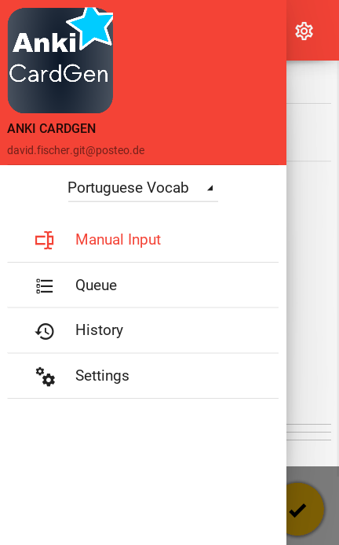
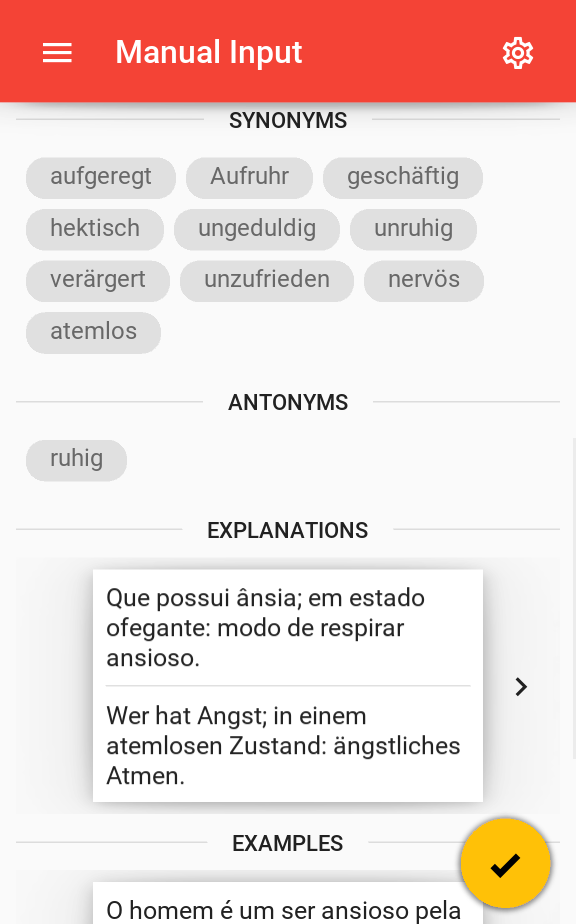
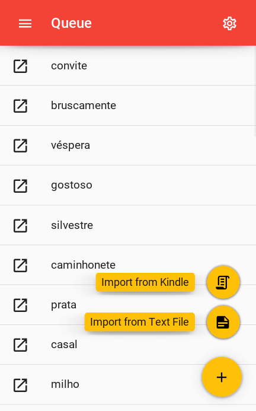
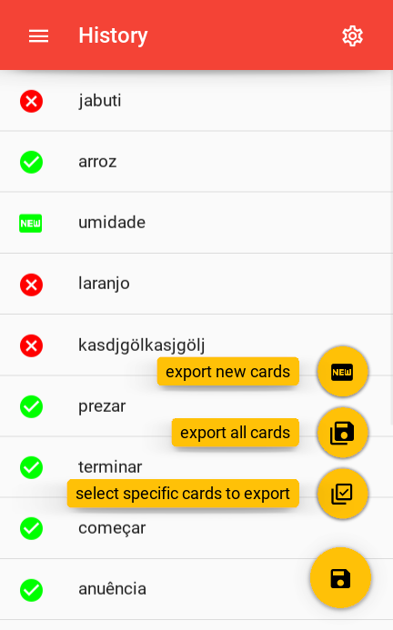

<div>

</br>
</br>
</br>
</br>
<h1>AnkiCardGen</h1>
</div>

[](https://github.com/psf/black)[](https://github.com/david-fischer/Anki_CardGen/blob/master/LICENSE) []() []() []()[]()

[Kivy](https://kivy.org/) App for mobile and desktop for quick generation of personalized language flash cards for [Anki](https://apps.ankiweb.net/) containing: Image, audio, example, synonym - antonym, definition and more! The interface is built with the material-design-inspired [KivyMD](https://github.com/kivymd/KivyMD). However, this project is not affiliated with Anki.

> **:warning: This project is still under development, see [current state](https://github.com/david-fischer/Anki_CardGen#-current-state). If you would like to contribute have a look at the [documentation]() and the [contribute](https://github.com/david-fischer/Anki_CardGen#-contribute) section.**

Currently supported languages:

* **Brazilian Portuguese**

### Screenshots

&nbsp;&nbsp;&nbsp;<!--  -->

<details>
<summary>More screenshots</summary>
&nbsp;&nbsp;&nbsp;</details>
<details>
<summary>Example Cards</summary>
<h3>casa</h3>
    
    
    
<h3>comecar</h3>
    
    
    
<h3>convite</h3>
    
    
    
</details>


## ❓ About

Anki is a powerful tool for reviewing flash cards, in particular for language learning.

Having flash cards with multiple cues (image, audio, example-sentence, ...) is beneficial, but one does not want to spend a large amount of time in the creation. This project aims to provide the solution to this process. The app automatically downloads and processes data for a given word in the target language and offers the user a choice of various options for the content of the card.

This allows quick generation of high-quality, personalized cards.

## ⚡ Quick Start

You can install the [current version](https://github.com/david-fischer/Anki_CardGen/tree/data/android) of the Android-apk and try it out. So far it is only tested on an S5 Neo.

> **⚠️ Not yet working:** The packaged application is also available as a single-file executable for [linux](https://github.com/david-fischer/Anki_CardGen/raw/data/linux/AnkiCardGen) and [windows](https://github.com/david-fischer/Anki_CardGen/raw/data/windows/AnkiCardGen.exe).

## 🏗 Current State

* [x] Processing of single words
* [x] Batch-import from .txt and **from kindle-notes**
* [x] Queue-system for words that have not been processed
* [x] Overview over processed words and option to export as .apkg (**mobile app lacks proper management of paths**)
* [ ] change of languages
* [ ] spacy on mobile
* [ ] pyinstaller workflows for windows and linux
* [ ] installation via setup.py
* [ ] executables for windows and linux
* [ ] clean-up package-structure, imports and file-paths

## 🚧 Installing

### Prerequisites

Clone repository and install requirements:

```
git clone https://github.com/david-fischer/Anki_CardGen.git
cd Anki_CardGen
pip install -r requirements.txt
```

Install [spacy](https://github.com/explosion/spaCy) model, e.g. for portuguese:

```
python -m spacy download pt_core_news_sm
```

**NOTE:** This model is used to find the dictionary form of words (e.g. casas -> casa). It is optional and does not yet work on the mobile version.

### Building the Android App

The apk is built using [Buildozer](https://buildozer.readthedocs.io/en/latest/)
```
buildozer android debug deploy
```

### Building the iOS App
(not yet tested)
```
buildozer ios debug deploy
```

## 🎯 Troubleshooting

* python==3.7

## 🔧 Usage
Simply start the app from the `src` folder:

```
cd src
python main.py
```


## 🚀 Contribute
* So far, the project only supports Brasilian Portuguese, as it is the language I am currently learning.
  Feel free to contribute e.g. by implementing crawlers for the necessary information for words in other languages as well.
* Unfortunately, I had problems building SpaCy (more precisely its dependency blis) on arm. I therefore removed it from the dependencies in buildozer.spec and built the code to work around it if the package is not present.

## ✍️ Authors
- [David Fischer](https://github.com/david-fischer) - Author

## 🎉 Acknowledgements

`src/google-images-download` is basically https://github.com/Joeclinton1/google-images-download with minor fixes
