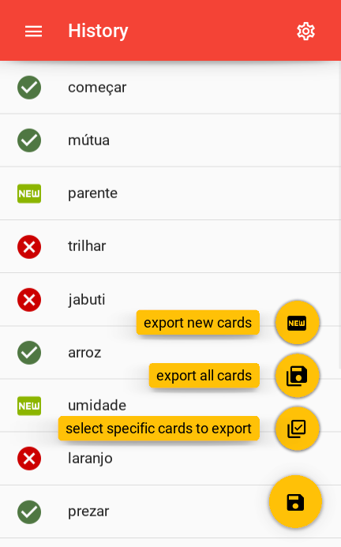
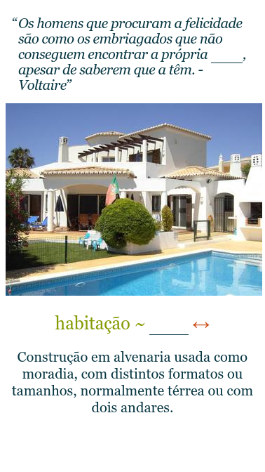

<div>

</br>
</br>
</br>
</br>
<h1>AnkiCardGen</h1>
</div>

[](https://github.com/psf/black) []() []()[]()
#### Screenshots

&nbsp;&nbsp;&nbsp;<!--  -->
<details>
<summary>More screenshots</summary>
&nbsp;&nbsp;&nbsp;</details>
<details>
<summary>Example Cards</summary>
<h3>casa</h3>
    
    
    
<h3>comecar</h3>
    
    
    
<h3>convite</h3>
    
    
    
</details>


[Kivy](https://kivy.org/) App (mobile/dektop) for quick generation of personalized language flash cards for [Anki](https://apps.ankiweb.net/) containing:

* Image
* Audio
* Example
* Synonym - Antonym
* Definition

Currently supported languages:
* **Brazilian Portuguese**

## ❓ About

Anki is a powerful tool for reviewing flash cards, in particular for language learning.

Having flash cards with multiple cues (image, audio, example-sentence, ...) is beneficial, but one does not want to spend a large amount of time in the creation. This project aims to provide the solution to this process. The app automatically downloads and processes data for a given word in the target language and offers the user a choice of various options for the content of the card.

This allows quick generation of high-quality, personalized cards.

## 🏗 Current State

* [x] Importing a list of words
    * [x] User interface to load
        * [x] from exported kindle-notes in html-format
        * [x] from simple text file
    * [x] Pre-Processing
        * [x] Extracting the words
        * [x] Removal of punctuation
        * [x] Get dictionary form of word **(only desktop)**
    * [x] Clicking on loaded words to start generation-process
* [x] Processing single words
    * [x] Fetching necessary data to build card
    * [x] Provide user interface to select content of card
    * [x] Process the user input
    * [x] Downloading image and audio files
    * [x] Building the Anki card from html-templates

- [ ] Incremental saving of apkgs
- [ ] Error handling for incomplete selection
- [ ] Chaning of languages

## 🚧 Installing

### Prerequisites

Download repository and install requirements:

```
git clone https://github.com/david-fischer/Anki_CardGen.git
cd Anki_CardGen
pip install -r requirements.txt
```

Install [spacy](https://github.com/explosion/spaCy) model, e.g. for portuguese:

```
pythn -m spacy download pt_core_news_sm
```

**NOTE:** This model is used to find the dictionary form of words (e.g. casas -> casa). It is optional and does not yet work on the mobile version.

### Building the Android App

The apk is built using [Buildozer](https://buildozer.readthedocs.io/en/latest/)
```
buildozer android debug deploy
```

### Building the iOS App
(not yet tested)
```
buildozer ios debug deploy
```

## 🎯 Troubleshooting

* python3.8 not working -> change to 3.7

## 🔧 Usage
(add info)

## 🚀 Contribute
* So far, the project only supports Brasilian Portuguese, as it is the language I am currently learning.
  Feel free to contribute e.g. by implementing crawlers for the necessary information for words in other languages as well.
* Unfortunately, I had problems building SpaCy (more precisely its dependency blis) on arm. I therefore removed it from the dependencies in buildozer.spec and built the code to work around it if the package is not present.make blis work on mobile

## ✍️ Authors
- [David Fischer](https://github.com/david-fischer) - Author

## 🎉 Acknowledgements

* [ ] List info here
