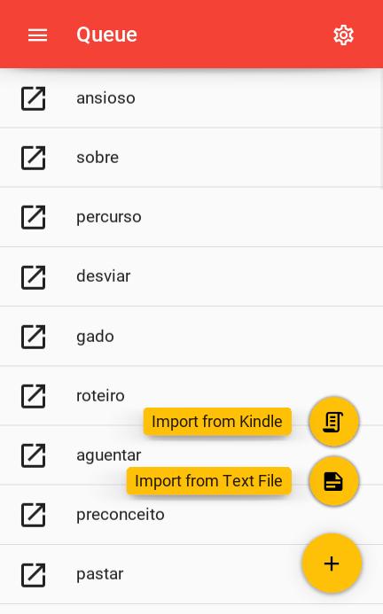

<div>

</br>
</br>
</br>
</br>
</br>
<h1>AnkiCardGen</h1>
</div>

[](https://github.com/psf/black) [](https://github.com/david-fischer/Anki_CardGen/blob/master/LICENSE) []() [](https://anki-cardgen.readthedocs.io/en/latest/?badge=latest)

Python [Kivy](https://kivy.org/) App for mobile and desktop for quick generation of personalized language flash cards for [Anki](https://apps.ankiweb.net/) containing: Image, audio, example, synonym - antonym, definition and more! The interface is built w ith the material-design-inspired [KivyMD](https://github.com/kivymd/KivyMD). The project is not affiliated with Anki.

> **:warning: Currently under heavy development.**​

Currently supported languages:

* **Brazilian Portuguese**

### Screenshots
<!-- jinja-block screenshots
$ for file in img_files
$ if loop.index ==4
{{ comment_tag }}

<details>
<summary>More screenshots</summary>
$ endif
&nbsp;{#- this comment removes whitespace (because of the - sign) #}
$ if loop.last and loop.length >=4
</details>
$ endif
$ endfor

<details>
<summary>Example Cards</summary>
$for word in words
<h3>{{ word.name }}</h3>
$for side in word.sides
    
$ endfor
$ endfor
</details>
jinja-block screenshots-->
<!-- jinja-out screenshots start-->
&nbsp;&nbsp;&nbsp;<!-- -->

<details>
<summary>More screenshots</summary>
&nbsp;&nbsp;&nbsp;</details>
<details>
<summary>Example Cards</summary>
<h3>casa</h3>
    
    
    
<h3>comecar</h3>
    
    
    
<h3>convite</h3>
    
    
    
</details>
<!-- jinja-out screenshots end-->

## ❓ About

Anki is a powerful tool for reviewing flash cards, in particular for learning languages.

Having flash cards with multiple cues (image, audio, example sentence, ...) is beneficial for memorization but one does not want to spend a large amount of time on the creation of the cards. This project aims to provide a solution to this process. The app automatically downloads and processes data for a given word in the target language and offers the user a choice of various options for the content of the card.

This allows quick generation of high-quality, personalized cards.

## ⚡ Quick Start

You can find the application packaged with PyInstaller for [Linux](https://github.com/david-fischer/Anki_CardGen/releases/latest/download/acg_pyinstaller_linux.zip) and soon also for Windows.

## 🏗 To Do

* [ ] change of languages
* [ ] save both lemma and word
* [ ] filter words (word_state: not_wanted)
* [ ] use `__name__` as default for cookbook.register()
* [ ] change deck names for exported apkg
* [ ] add other spacy models (only important for pyinstaller)
* [x] update github action
* [x] generalize Dockerfile

## 🚧 Installation

### For use

* Setup new virtual environment with python 3.9, e.g. with conda

```
conda create -n "<environment_name>" python==3.9
conda activate <environment_name>
pip install git+https://github.com/david-fischer/Anki_CardGen.git
```

### For Development

```
conda create -n "<environment_name>" python==3.9
pip install poetry
git clone https://github.com/david-fischer/Anki_CardGen.git
cd Anki_CardGen
poetry install --no-root
pre-commit install
```

You can now start the app **from the repo folder** with

```
python -m acg.main
```

<!-- ``` -->
<!-- python -m spacy download pt_core_news_sm -->
<!-- ``` -->

<!-- **NOTE:** This model is used to find the dictionary form of words (e.g. casas -> casa). It is optional and does not yet work on the mobile version. -->

<!-- ## 🎯 Troubleshooting -->

## 🔧 Usage

### Following Quickstart

If you downloaded the packaged application, unzip the folder, make `AnkiCardGen` (or `AnkiCardGen.exe`) executable and start it by double-clicking it or by calling it from the terminal.

### Following Installation

After installation you should be able to start the app from the command line:
```
acg
```

## 🚀 Contribute

### Parsers:

* make a new file in the acg/parsers folder

* Inherit from parsers.base_parsers.AsyncParser
* import in parsers/\__init__.py and register it
* use it in template.py

## 🎉 Acknowledgements

* `acg/google-images-download` is basically https://github.com/Joeclinton1/google-images-download with minor fixes
<!-- jinja-block deps
{{ "\n".join(dep_strings) }}
jinja-block deps-->
<!-- jinja-out deps start-->
 * [appdirs](http://github.com/ActiveState/appdirs) - A small Python module for determining appropriate platform-specific dirs, e.g. a "user data dir".
 * [titlecase](https://github.com/ppannuto/python-titlecase) - Python Port of John Gruber's titlecase.pl
 * [attrs](https://www.attrs.org/) - Classes Without Boilerplate
 * [beautifulsoup4](http://www.crummy.com/software/BeautifulSoup/bs4/) - Screen-scraping library
 * [bidict](https://bidict.readthedocs.io) - The bidirectional mapping library for Python.
 * [certifi](https://certifiio.readthedocs.io/en/latest/) - Python package for providing Mozilla's CA Bundle.
 * [genanki](http://github.com/kerrickstaley/genanki) - Generate Anki decks programmatically
 * [kivymd](https://github.com/kivymd/KivyMD) - Set of widgets for Kivy inspired by Google's Material Design
 * [googletrans](https://github.com/ssut/py-googletrans) - Free Google Translate API for Python. Translates totally free of charge.
 * [Kivy](http://kivy.org) - A software library for rapid development of hardware-accelerated multitouch applications.
 * [lxml](https://lxml.de/) - Powerful and Pythonic XML processing library combining libxml2/libxslt with the ElementTree API.
 * [pandas](https://pandas.pydata.org) - Powerful data structures for data analysis, time series, and statistics
 * [Pillow](https://python-pillow.org) - Python Imaging Library (Fork)
 * [pony](https://ponyorm.com) - Pony Object-Relational Mapper
 * [requests](https://requests.readthedocs.io) - Python HTTP for Humans.
 * [spacy](https://spacy.io) - Industrial-strength Natural Language Processing (NLP) in Python
 * [toolz](https://github.com/pytoolz/toolz/) - List processing tools and functional utilities
 * [Unidecode](UNKNOWN) - ASCII transliterations of Unicode text
 * [aiohttp](https://github.com/aio-libs/aiohttp) - Async http client/server framework (asyncio)
 * [toml](https://github.com/uiri/toml) - Python Library for Tom's Obvious, Minimal Language
<!-- jinja-out deps end-->
