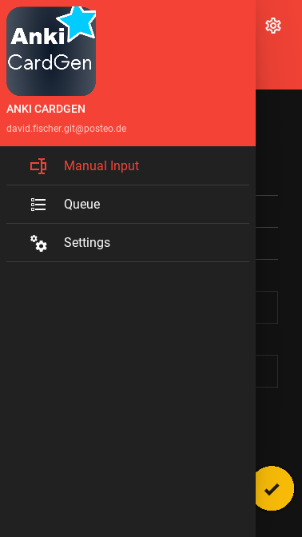
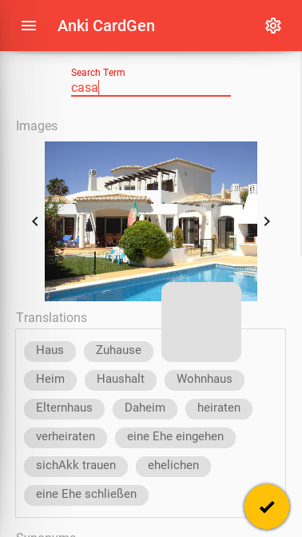
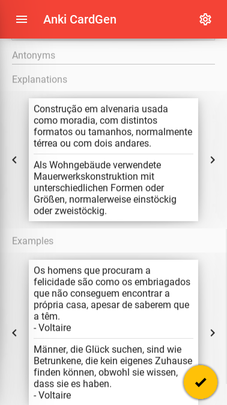
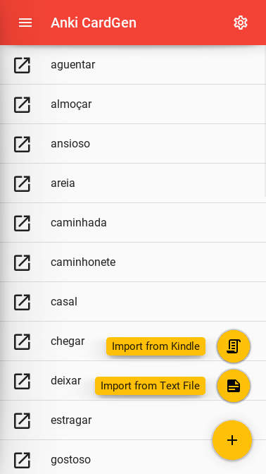

User Interface
========================================

The user interface is based on :mod:`kivy` and :mod:`kivymd`.

The project is organized as follows:
Each screen of the app is defined by a screens/<screen_name>.kv file. The root widget of the screen is named
<ScreenNameRoot> and implemented in the file screens/<screen_name>.py.

.. toctree::
   :maxdepth: 1
   :glob:

   screens/*
